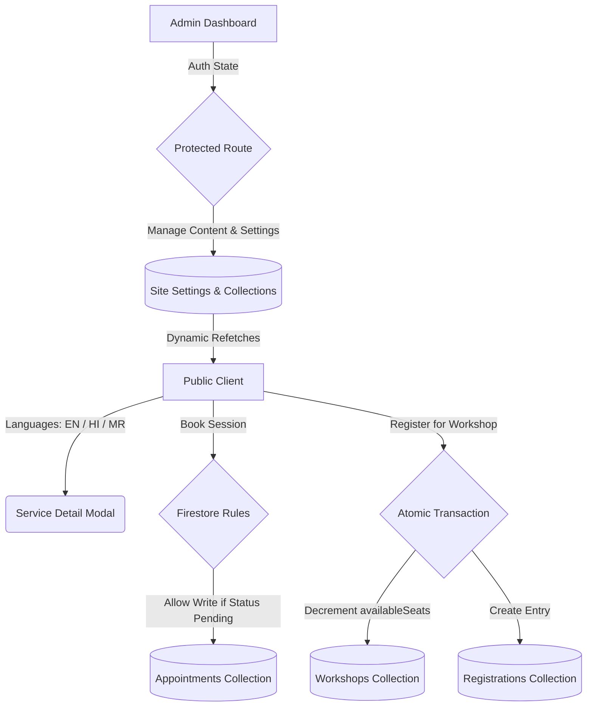

<p align="center">
  
</p>

<h1 align="center">🌌 Divya Urja</h1>
<p align="center"><strong>Transforming lives through the ancient wisdom of Numerology, Vastu Shastra, and Energy Science.</strong></p>

<p align="center">
  <a href="https://divya-urja.web.app"></a>
</p>

<p align="center">
  
  
  
  
  
  
</p>

---

## 📖 Overview

**Divya Urja** is a comprehensive digital platform designed for holistic consultation services. The application consists of a premium, fully localized public website where clients can book personalized appointments, register for workshops, and read educational blogs, backed by a robust administrative dashboard for client pipeline, content, and website setting management.

---

## 🛠️ Key Features

<details>
<summary>🌐 Complete Internationalization (EN / HI / MR)</summary>
<ul>
  <li>Seamless client-side language switching between <strong>English</strong>, <strong>Hindi (हिन्दी)</strong>, and <strong>Marathi (मराठी)</strong>.</li>
  <li>Custom React <code>LanguageProvider</code> syncing selections with <code>localStorage</code> to maintain preferences.</li>
  <li>Full structural translation covering navbar items, badges, booking workflows, and call-to-actions.</li>
</ul>
</details>

<details>
<summary>📅 Appointment Booking & Service Detail Modals</summary>
<ul>
  <li>Interactive service directory showing fees and detail modals with structured benefits.</li>
  <li>Step-by-step reservation form validated with React Hook Form and Zod schemas.</li>
  <li>Automatic dashboard entry routing pending consultations to the admin pipeline.</li>
</ul>
</details>

<details>
<summary>🎓 Workshop Seat Allocation (Race-Condition Free)</summary>
<ul>
  <li>Automated workshop registration forms.</li>
  <li>Database transactions decrement workshop seats atomically in Firestore.</li>
  <li>Rules enforce booking locks once availability falls to 0, preventing overselling.</li>
</ul>
</details>

<details>
<summary>📝 Premium Blog Editor & Markdown Compiler</summary>
<ul>
  <li>Dual-pane editor featuring side-by-side Markdown writing and live rendering.</li>
  <li>Image insertion utility which compresses and encodes files to base64.</li>
  <li>Draft vs. Published state management to control public availability.</li>
</ul>
</details>

<details>
<summary>⚙️ Site Settings & Dynamic Layout Controls</summary>
<ul>
  <li>Admin panel configures landing headings, descriptions, contact cards, working hours, and social media links.</li>
  <li>Toggle switches dynamically enable/disable visible sections (Blogs, Testimonials, Workshops) on the public homepage.</li>
</ul>
</details>

---

## 📐 Architecture & Flow



---

## 📂 Project Structure

```
├── .firebase/            # Firebase local configurations
├── public/               # Public assets (custom logo, default SVGs)
├── src/
│   ├── app/              # Next.js App Router Pages
│   │   ├── (public)/     # Public user routes (services, book, contact, workshops, etc.)
│   │   └── admin/        # Admin dashboard pages (settings, blogs, appointments, leads)
│   ├── components/       # Shared UI components & layout sections
│   ├── context/          # Context Providers (Language, Auth)
│   ├── hooks/            # Custom collection state hooks
│   ├── i18n/             # Translations dictionary (EN / HI / MR)
│   ├── services/         # Firestore read/write operations & transactions
│   ├── types/            # TypeScript interfaces & declarations
│   └── utils/            # Helper modules, base64 converters, and markdown parsers
├── firestore.rules       # Granular database security rules
└── storage.rules         # Storage directory access constraints
```

---

## ⚡ Setup & Development

### 1. Prerequisite Installations
Ensure you have **Node.js (v18+)** and **npm** installed.

### 2. Install Dependencies
Clone the repository and run:
```bash
npm install
```

### 3. Environment Config
Create a `.env.local` file in the root directory and add your Firebase configuration parameters:
```env
NEXT_PUBLIC_FIREBASE_API_KEY=your_api_key
NEXT_PUBLIC_FIREBASE_AUTH_DOMAIN=your_auth_domain
NEXT_PUBLIC_FIREBASE_PROJECT_ID=your_project_id
NEXT_PUBLIC_FIREBASE_STORAGE_BUCKET=your_storage_bucket
NEXT_PUBLIC_FIREBASE_MESSAGING_SENDER_ID=your_sender_id
NEXT_PUBLIC_FIREBASE_APP_ID=your_app_id
```

### 4. Running Locally
Run the Next.js development server:
```bash
cmd /c "npm run dev"
```
Open [http://localhost:3000](http://localhost:3000) to view the development build.

### 5. Production Compilation
Verify code compilation and static site generation export:
```bash
cmd /c "npm run build"
```

---

## 🚀 Firebase Deployment

Ensure you are authenticated with the Firebase CLI:
```bash
cmd /c "firebase login"
```

To compile and deploy the latest web assets and Firestore configurations:
```bash
cmd /c "npm run build"
cmd /c "firebase deploy --only hosting,firestore"
```

---

## 🔒 Security Posture

Our **`firestore.rules`** enforce strict access policies:
* **Blogs/Services/Events/Settings**: Read access is public; create, update, and delete access requires admin authentication.
* **Leads (Contacts)/Appointments/Registrations**: Public creation is permitted (backed by Zod schema and rules validation on length/types); viewing and updating is restricted entirely to authenticated admins.
* **Seats Integrity**: Public users can decrement seats by exactly `1` on active workshops but cannot modify any other properties.
